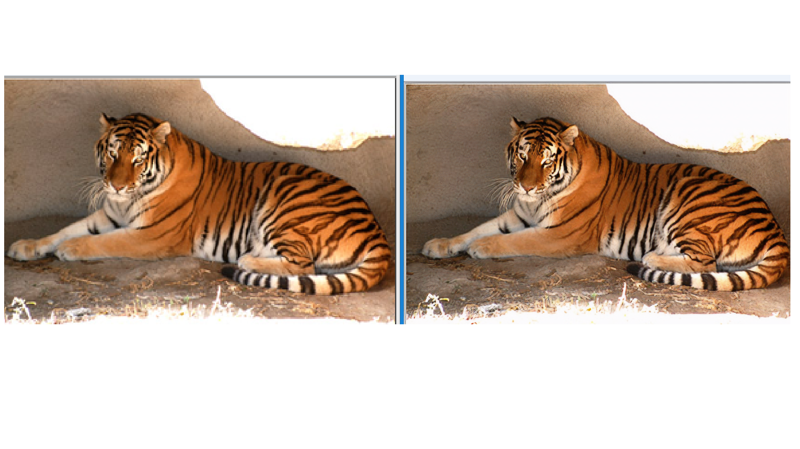
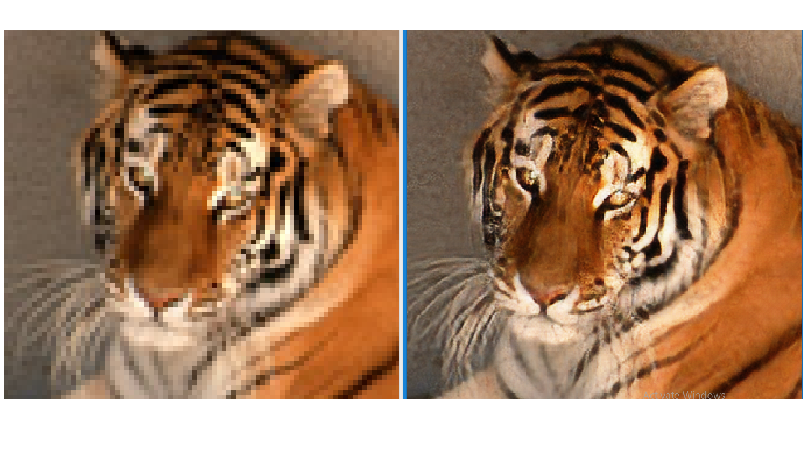

# SRGAN
Based on the implementation by [tensorlayer/srgan](https://github.com/tensorlayer/srgan)

Mini Project for VI semester:
  * Model trained and evaluated on Google Colab for 500 epochs
  * dataset used: DIV2K (training and validation). Imported from google drive.
  * Pretrained VGG19 model was used.
   
 
## OUTPUTS:
* output   
  
* output  (zoomed in)

### Project by:
* [Bhargav Ram](https://github.com/BhargavKilambi) & [Anantha Rohan](https://github.com/AnanthaRohan)
### Reference
* [1] [Photo-Realistic Single Image Super-Resolution Using a Generative Adversarial Network](https://arxiv.org/abs/1609.04802)
* [2] [GAN — Super Resolution GAN (SRGAN)](https://medium.com/@jonathan_hui/gan-super-resolution-gan-srgan-b471da7270ec)

